<div align="center">


<br/>

<a href="https://git.io/typing-svg">
  
</a>

<br/><br/>


</div>

<br/>


## 👋 Introduction


I'm **Shahnawaz Alam**, a **Full-Stack .NET Developer** with **2+ years** of experience owning production backend systems across **enterprise HCM** and **fintech** platforms.

- 🧩 Sole **Backend SPOC** for a **100+ endpoint API suite** supporting a 7–9 member engineering team
- 🔁 Led a **legacy VB6-to-.NET migration**, delivering **20+ business-critical financial modules** across **7–8 branches** within a **1-year** timeline
- 🔐 Skilled in **C#, ASP.NET Core Web API, SQL Server, Oracle SQL, RESTful architecture**, and **JWT/RBAC** security
- ⚙️ Hands-on with **microservices** — Ocelot API Gateway, Docker, xUnit — and **React.js**
- 🎯 Seeking a full-stack or backend-focused **.NET engineering role** to own systems end-to-end and ship scalable, secure software

<br clear="right"/>


## 🚀 Current Work

<div align="center">

| 🏢 Enterprise HRMS | 🧬 .NET Microservices | 📱 Social Media Platform |
|:---:|:---:|:---:|
| 100+ endpoint HCM backend | Ocelot • Docker • xUnit | JWT/RBAC • API Gateway |

</div>

```txt
const currentlyWorkingOn = {
  platform: "FFI HCM Platform",
  role: "Sole Backend SPOC",
  stack: ["ASP.NET Core Web API", "SQL Server", "JWT", "RBAC"],
  sideProject: "Microservices-based Social Media Platform",
  focus: ["Ocelot API Gateway", "Docker", "xUnit", "React.js"]
};
```


## 🧠 About Me

<div align="center">

```yaml
about_me:
  builds: "Scalable backend systems using ASP.NET Core"
  enjoys: "Solving architecture problems"
  passion: "Designing clean, secure REST APIs"
  learning: "Distributed systems"
  loves: "Building products from scratch"
  mindset: "System design & clean, maintainable code"
```

</div>

<details>
<summary>🔎 <b>Click to expand — Engineering Philosophy</b></summary>
<br/>

> I believe great backend engineering is invisible — the API just works, the data is always consistent, and the system scales without drama. That's the standard I hold my own code to.

- 🏗️ Architecture-first thinking, grounded in **SOLID** principles and proven **design patterns**
- 🔒 Security is not an afterthought — **JWT auth, RBAC, and idempotency** are baked into every API I design
- 🧪 Confidence through tests — **xUnit** and structured **UAT validation** before anything ships
- 🤝 Close collaboration with frontend teams to keep API contracts clean and releases stable

</details>


## 🛠️ Tech Stack

### Languages
<p>


</p>

### 🎨 Frontend Skills
<p>


</p>

### ⚙️ Backend Skills
<p>


</p>

### 🏛️ Architecture Skills
<p>


</p>

### 🐳 DevOps
<p>


</p>

### 🧰 Tools & Testing
<p>


</p>

### 🗄️ Databases
<p>


</p>

### ☁️ Cloud & Platforms
<p>
  
  
  
</p>


## 💼 Experience

<table>
<tr>
<td width="50%" valign="top">

### 🏢 Software Engineer
**Blu Parrot Ventures** · Aug 2024 – Present

**FFI — HCM Platform** *(Nov 2025 – Present)*
- Sole **Backend SPOC** for a **100+ endpoint** HCM service (.NET Web API + SQL Server), serving a 7–9 member team
- Architected secure, scalable REST APIs with **RBAC, JWT, and idempotency controls**
- Designed and maintained **SQL Server schema** and data-integrity rules for core HR workflows
- Partnered with frontend engineers on API contracts, reducing integration friction

</td>
<td width="50%" valign="top">

### 🏦 Bajaj Corporation — Wealthmaker
*(Aug 2024 – Oct 2025)*

- Led migration of legacy **VB6 → .NET** across a **5-engineer team** for a financial services client
- Delivered **20+ business-critical modules**: Finance, Insurance, Account, Mutual Funds, NPS, Reporting, Reconciliation
- Used **ASP.NET Web Forms, MVC, jQuery, Oracle SQL**, stored procedures
- Rolled out across **7–8 branches** in a ~1-year cycle, improving transaction speed
- Owned post-go-live support: defect triage, structured **UAT**, successful client handover

</td>
</tr>
</table>

<details>
<summary>🎓 <b>Earlier Experience — Software Developer Intern</b></summary>
<br/>

**Vienna Advantage** · Mohali, India · Feb 2024 – Apr 2024
- Built components for the **AD module** within Vienna Advantage's proprietary ERP framework
- Applied **OOP principles** in C#, SQL, and JavaScript under senior engineer guidance

</details>


## 🌟 Featured Projects

<table>
<tr>
<td width="33%" valign="top">

### 🧬 Spectrum
**Modern Microservices Backend**

Personal project — backend microservices for a social media application with an **Ocelot API Gateway** for request routing and **JWT/RBAC** for auth. Containerized with **Docker**; validated with **xUnit** unit and integration tests.

`.NET` `Docker` `Ocelot` `JWT` `RBAC` `Microservices` `xUnit`

</td>
<td width="33%" valign="top">

### 🏢 Enterprise HRMS
**FFI HCM Platform**

100+ endpoint backend API suite covering authentication, employee management, and core business logic, backed by a carefully designed **SQL Server** schema.

`.NET Web API` `SQL Server` `JWT` `RBAC` `REST APIs`

</td>
<td width="33%" valign="top">

### 📱 Social Media Platform
**Microservices Backend (Ongoing)**

Backend-owned microservices architecture with authentication, service routing, and containerized deployment — built as a personal deep-dive into distributed systems.

`Microservices` `Docker` `JWT` `API Gateway`

</td>
</tr>
</table>


## 📊 GitHub Stats

<div align="center">

<!-- Streak Stats -->


<br><br>

<!-- Profile Summary -->


<br><br>

<!-- Stats Row -->


<br>

<!-- Bottom Row -->


</div>


## 📈 Contribution Graph

<div align="center">


<br/><br/>


<picture>
  <source
    media="(prefers-color-scheme: dark)"
    srcset="https://raw.githubusercontent.com/snawaza243/snawaza243/output/github-contribution-grid-snake-dark.svg"
  />
  
</picture>

</div>


## 🏆 GitHub Trophies

<div align="center">


</div>


## 🎖️ Achievements & Certifications

<p>


</p>

**🎓 Bachelor of Technology, Computer Science & Engineering**
Maharishi Markandeshwar Deemed to be University, Mullana-Ambala, Haryana · Jul 2020 – May 2024 · **CGPA: 8.31**

**Key Career Highlights:**
- 🏗️ Sole Backend SPOC for a **100+ endpoint** production API suite
- 🔁 Led a **VB6-to-.NET migration** delivering **20+ modules across 7–8 branches**
- 👥 Led a **5-engineer team** through a full legacy modernization cycle
- 🔐 Hands-on production experience with **microservices, API gateways, and secure auth**


## 🗺️ Learning Roadmap

```mermaid
graph LR
    A[Core .NET & C#] --> B[Advanced System Design]
    B --> C[Distributed Systems]
    C --> D[Event-Driven Architecture]
    D --> E[Cloud-Native .NET]
    E --> F[Kubernetes & Service Mesh]
    style A fill:#8A63FF,stroke:#302B63,color:#fff
    style B fill:#8A63FF,stroke:#302B63,color:#fff
    style C fill:#302B63,stroke:#8A63FF,color:#fff
    style D fill:#302B63,stroke:#8A63FF,color:#fff
    style E fill:#0d1117,stroke:#8A63FF,color:#fff
    style F fill:#0d1117,stroke:#8A63FF,color:#fff
```



- [x] Core .NET, C#, ASP.NET Core Web API
- [x] SOLID Principles & Design Patterns
- [x] Microservices — Ocelot Gateway, Docker, xUnit
- [ ] Deep dive into Distributed Systems & Event-Driven Architecture
- [ ] Cloud-native .NET (Azure / GCP deployments at scale)
- [ ] Kubernetes & container orchestration at scale


## 🌍 Open Source Goals

- 🤝 Contribute to open-source **.NET / ASP.NET Core** libraries and tooling
- 📦 Publish reusable **microservices building blocks** (auth, gateway configs, resiliency patterns)
- 📖 Write technical deep-dives on backend architecture and API security
- 🌱 Grow the **Spectrum** microservices project into a public reference architecture


## 💬 Random Dev Quote

<div align="center">


</div>


## 🤝 Connect With Me

<div align="center">

<a href="https://www.linkedin.com/in/snawaza243">
  
</a>

<a href="https://github.com/snawaza243">
  
</a>

<a href="https://snawaza243.github.io/portfolio/">
  
</a>

<a href="mailto:snawaza243@gmail.com">
  
</a>

<a href="https://x.com/snawaza243">
  
</a>

<a href="https://leetcode.com/u/snawaza243/">
  
</a>
</div>


<div align="center">

## 👁️ Profile Views


<br/>

### 💡 "Backend-first engineer. System design enthusiast. Clean architecture lover. Problem solver. Always learning."

<br/>


**⭐ Thanks for visiting my profile — let's build something scalable together!**

</div>
